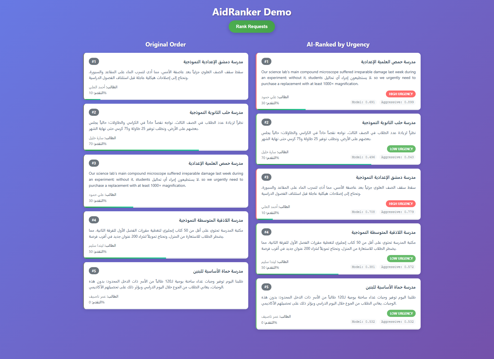
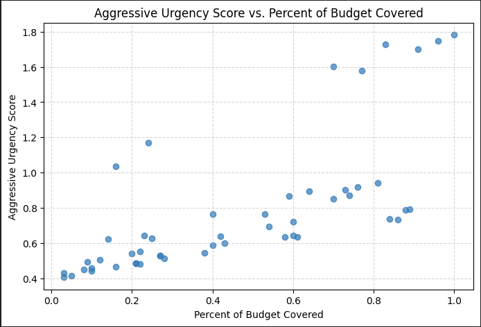
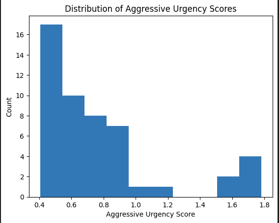
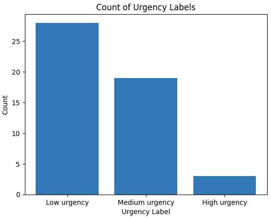
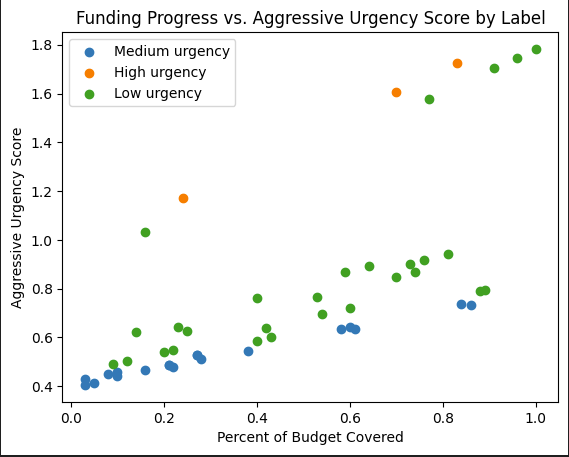

# AidRanker

AI-powered urgency ranking system for aid requests using zero-shot classification.

## Overview

AidRanker analyzes aid requests written in Arabic and English to automatically rank them by urgency level using machine learning. The system uses a transformer-based zero-shot classification model to categorize requests as High, Medium, or Low urgency, helping prioritize resource allocation.

## Features

- **Multi-language Support**: Handles Arabic and English text
- **Zero-shot Classification**: Uses `joeddav/xlm-roberta-large-xnli` model
- **Urgency Scoring**: Multiple scoring algorithms (model-based and aggressive)
- **Secure Authentication**: Token-based API security
- **Real-time Processing**: Fast ranking of multiple requests
- **Web Interface**: React-based frontend for easy interaction

## Architecture

- **Backend**: Flask API with transformers pipeline
- **Frontend**: React.js web application  
- **Model**: XLM-RoBERTa large model for multilingual classification
- **Authentication**: SHA256 token verification
- **Deployment**: Docker containerization

## Quick Start

### Prerequisites

- Docker and Docker Compose
- Node.js and npm (for frontend development)
- Python 3.11+ (for local backend development)

### Running with Docker (Recommended)

1. **Start both services**:
   ```bash
   docker-compose up -d
   ```

2. **Access the application**:
   - Frontend: http://localhost:3000
   - Backend API: http://localhost:5000

That's it! Both services will start automatically with proper networking and health checks.

### Local Development

#### Backend Setup

```bash
cd backend
pip install -r requirements.txt
python app.py
```

#### Frontend Setup

```bash
cd frontend
npm install
npm start
```

## API Documentation

### Authentication

All API requests require an authentication token in the request body:

```json
{
  "auth_token": "your_secure_token_here"
}
```

### Endpoints

#### POST /rank

Ranks aid requests by urgency.

**Request:**
```json
{
  "auth_token": "aidranker_secure_2024",
  "requests": [
    {
      "school": "School Name",
      "requested_by": "Person Name",
      "description": "Description of the aid request",
      "percent_done": 0.5
    }
  ]
}
```

**Response:**
```json
{
  "ranked_requests": [
    {
      "description": "Description text",
      "percent_done": 0.5,
      "urgency_label": "High urgency",
      "urgency_score_model": 0.892,
      "urgency_score_aggressive": 1.338,
      "school": "School Name",
      "requested_by": "Person Name"
    }
  ]
}
```

## Scoring Algorithm

AidRanker uses two scoring methods:

1. **Model Score**: Direct output from the zero-shot classifier
2. **Aggressive Score**: `model_score × (1 + percent_done)` - prioritizes partially completed urgent requests

Requests are ranked by aggressive score in descending order.

## Security

- Token-based authentication using SHA256 hashing
- CORS enabled for cross-origin requests
- No sensitive data logged or exposed
- Secure Docker container deployment

## Configuration

### Backend Configuration

- **Port**: 5000 (configurable in docker-compose.yml)
- **Token**: Set via `EXPECTED_TOKEN_HASH` in app.py
- **Model**: joeddav/xlm-roberta-large-xnli (loaded at startup)

### Frontend Configuration

- **Port**: 3000 (React default)
- **API URL**: Configured via proxy in package.json
- **Token**: Set in `API_SECRET` constant in App.js

## Sample Data

The application includes sample Arabic aid requests for schools covering:

- Structural repairs (roof damage, water leaks)
- Equipment needs (microscopes, furniture)
- Educational resources (books, materials)
- Food services (meal programs)
  
## Testing

### Backend Testing

```bash
# Test ranking with valid token
curl -X POST http://localhost:5000/rank \
  -H "Content-Type: application/json" \
  -d '{"requests": [{"description": "Urgent repair needed", "percent_done": 0.1}], "auth_token": "aidranker_secure_2024"}'

# Test authentication failure
curl -X POST http://localhost:5000/rank \
  -H "Content-Type: application/json" \
  -d '{"requests": [], "auth_token": "invalid_token"}'
```

## Dependencies

### Backend
- Flask 3.0.0
- transformers 4.30.0
- torch 2.1.0
- flask-cors 4.0.0
- numpy 1.24.4

### Frontend
- React 19.1.1
- axios 1.11.0
- react-scripts 5.0.1

# Model Performance Report

This section summarizes the zero-shot urgency classifier’s behavior on a 50-sample test set (mixed Arabic/English). All plots referenced below live in `./images/`.

---

## 1. Aggressive Urgency vs. Funding Progress  
  
- **Trend:** Higher funding‐progress boosts the “aggressive” urgency score (model_confidence × (1 + %covered)).  
- **Variation:** Even at the same funding level, scores vary, showing that the model is also reacting to the request text.

---

## 2. Distribution of Aggressive Urgency Scores  
  
- Scores range roughly from **0.4** to **1.8**.  
- The bulk (≈ 35/50) of requests fall between **0.4 – 0.8**, with a tail of high scores where %covered is large.

---

## 3. Count of Urgency Labels  
  
- **Low urgency:** 28 requests  
- **Medium urgency:** 19 requests  
- **High urgency:**  3 requests  
- Most requests default to Low or Medium; only a few cross the high‐urgency threshold.

---

## 4. Funding Progress vs. Aggressive Urgency by Label  
  
- **Low urgency** points (green) cluster at lower scores and lower %covered.  
- **Medium urgency** (blue) occupy the middle band.  
- **High urgency** (orange) appear only when model_confidence is high **and** funding is near complete.

---
